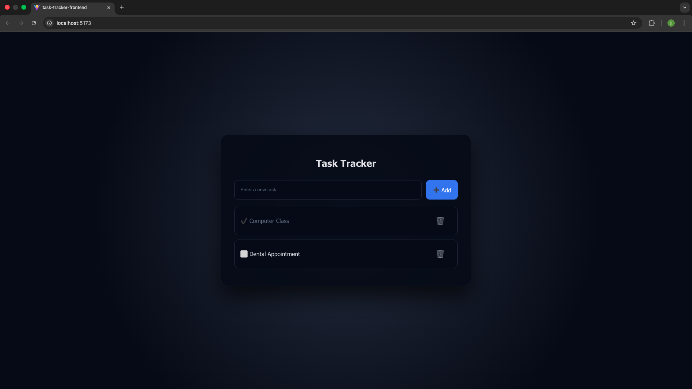
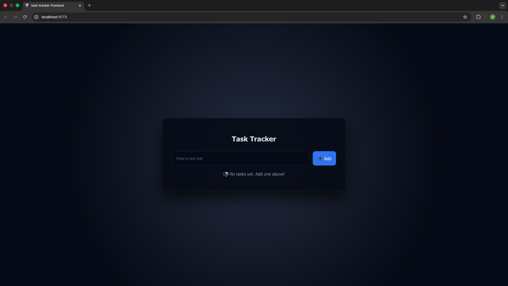

# 📝 Task Tracker – Frontend

A modern, interactive Task Tracker frontend built with **React** and **Vite**, featuring a clean dark-mode UI and smooth animations.

---

## 🚀 Features
- Create, update, delete tasks
- Toggle task completion
- Dark mode UI with modern design
- Smooth animations and hover effects
- Empty state handling
- Axios-based REST API integration
- Responsive and centered layout

---

## 🛠 Tech Stack
- React
- Vite
- JavaScript (ES6+)
- Axios
- Custom CSS (Dark Mode)

---

## 📸 Screenshots

### Main UI


### Empty State


---

## ▶️ Run Locally

```bash
npm install
npm run dev
